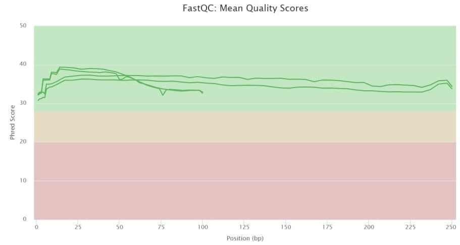
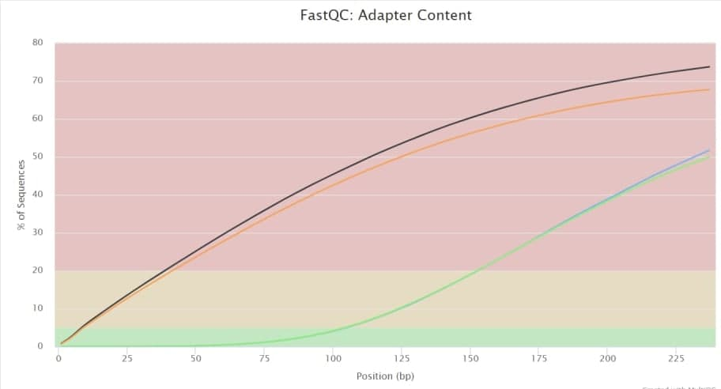

# hse21_hw1
1) Создаем папку с домашним заданием и ссылки в личной папке:
```
$ mkdir hw1
$ cd hw1
$ mkdir 1
$ cd 1
$ ls -1 /usr/share/data-minor-bioinf/assembly/* | xargs -tI{} ln -s {}
```
2) Делаем случайные чтения:
```
$ seqtk sample -s1607 oil_R1.fastq 5000000 > pe_R1.fastq
$ seqtk sample -s1607 oil_R2.fastq 5000000 > pe_R2.fastq
$ seqtk sample -s1607 oilMP_S4_L001_R1_001.fastq 1500000 > mp_R1.fastq
$ seqtk sample -s1607 oilMP_S4_L001_R2_001.fastq 1500000 > mp_R2.fastq
```
3) Оцениваем качество для полученных чтений с помощью fastQC
```
$ mkdir fastqc
$ ls *.fastq | xargs -P 4 -tI{} fastqc -o fastqc {}
```
4) Собираем все данные в единый отчет при помощи multiQC
```
$ mkdir multiqc
$ multiqc -o multiqc fastqc
```
5) Подрезаем чтения чтения по качеству и удаляем праймеры:
```
$ platanus_trim pe_R1.fastq pe_R2.fastq
$ platanus_internal_trim mp_R1.fastq mp_R2.fastq
```
6) Оцениваем качество подрезанных данных с помощью fastQC и собираем единый отчет при помощи multiQC
```
$ mkdir trimmed_fastq
$ mv -v *trimmed trimmed_fastq/
```
$ mkdir trimmed_fastqc
$ ls trimmed_fastq1/* | xargs -P 4 -tI{} fastqc -o trimmed_fastqc {}
```
$ mkdir trimmed_multiqc1
$ multiqc -o trimmed_multiqc1 trimmed_fastqc
```
До:


После:


До:


После:


До:


После:


7) Собираем контиги после подрезанных чтений:
```
$ time platanus assemble -o Poil -f trimmed_fastq1/pe_R1.fastq.trimmed trimmed_fastq1/pe_R2.fastq.trimmed 2> assemble.log                                                                       
$ head Poil_contig.fa
```
8) Собираем скаффолды:
```
$ time platanus scaffold -o Poil -c Poil_contig.fa -IP1 trimmed_fastq1/pe_R1.fastq.trimmed trimmed_fastq1/pe_R2.fastq.trimmed -OP2 trimmed_fastq1/mp_R1.fastq.int_trimmed trimmed_fastq1/mp_R2.fastq.int_trimmed 2> scaffold.log
```
9) Выделим в отдельный файл самый длинный скаффолд:
```
$ echo scaffold1_len3834754_cov231 > _tmp.txt
$ seqtk subseq Poil_scaffold.fa _tmp.txt > scaffold1_len3832152_cov231.fasta
```
10) Уменьшим количество гэпов при помощи подрезанных частей:
```
$ time platanus gap_close -o Poil -t 1 -c Poil_scaffold.fa -IP1 trimmed_fastq1/pe_R1.fastq.trimmed trimmed_fastq1/pe_R2.fastq.trimmed -OP2 trimmed_fastq1/mp_R1.fastq.int_trimmed trimmed_fastq1/mp_R2.fastq.int_trimmed 2> gapclose.log

```
11) Выделяем новый скаффолд в отдельный файл
```
echo scaffold1_cov231 > _tmp.txt
seqtk subseq Poil_gapclose.fa _tmp.txt > oil_genome.fna
```
